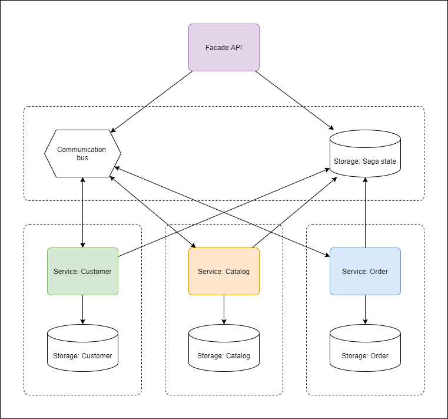
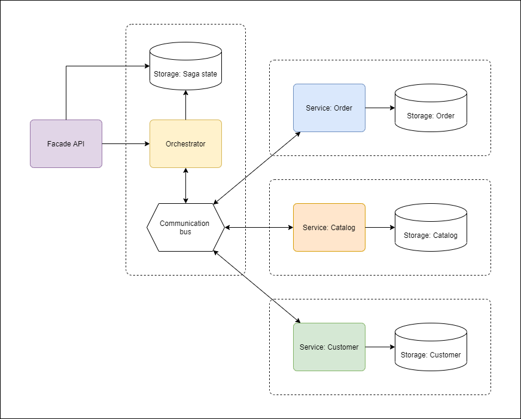
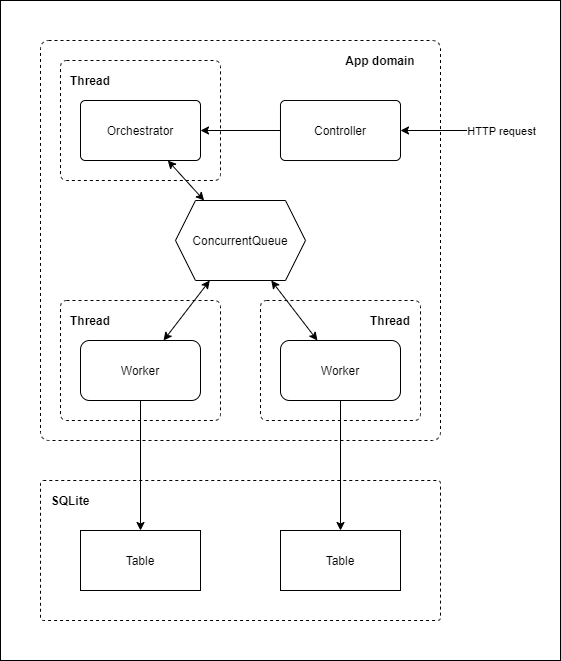
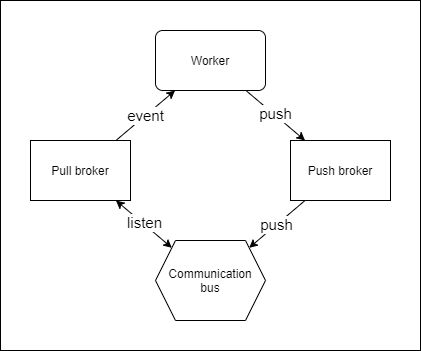
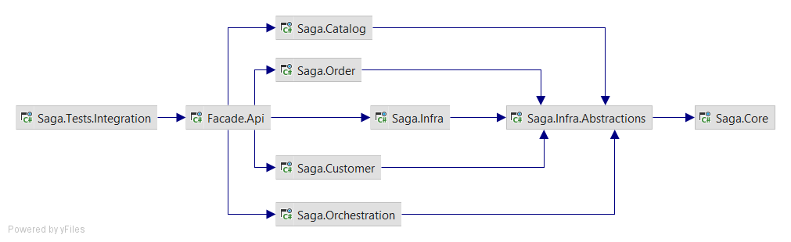
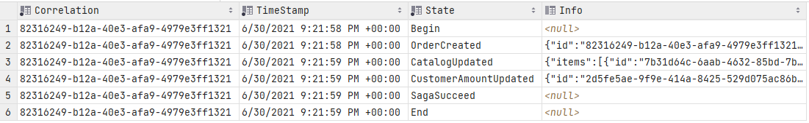
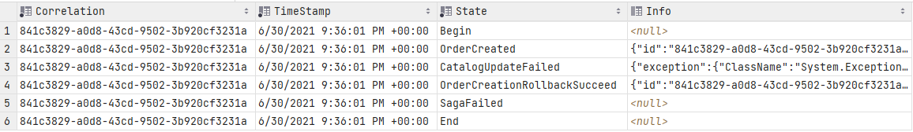
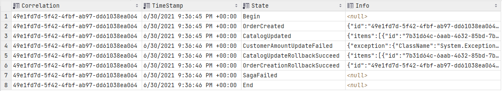

# Implementing distributed transaction in .NET using Saga pattern

## Problem

Let's imagine we're developing an online-shop and chose a microservices 
architecture approach, what actually means to have independent services
for different application contexts. Let's say, there are 3 contexts in our app:

* **Order** - orders data
* **Catalog** - goods catalog
* **Customer** - customers data

and each one assumes a separated data storage - this is a frequent approach, 
allowing to address such system quality attributes, as resiliency, fault/partition
tolerance, availability, independent scalability, etc. But the serious drawback,
this approach has is the **data consistency**.

Well, as long we're working with single service (e.g. **Catalog**), it's not a big
deal - all operations are atomic and can be easily undone. But what if we have to
make a multiple operations in different contexts, but as a single transaction?

Let's consider the following case: customer order a sneakers pair in our shop and
we'd like to fix the amount of this order (for loyalty program e.g.). That's what
we have to do:

* Add an order (**Order** context)
* Update sneakers quantity in goods catalog (**Catalog** context)
* Increase total orders amount for the customer (**Customer** context)

and all the operations should be done in a transaction, what means, if for example
catalog update failed, we have to delete an order created on previous step, and so
on.

This is obviously not a problem, when we using a single monolith storage with
transaction mechanism inside (a relation DB for example), but what to do in case
of distributed storage?

## Solution

Of course, the task isn't unusual, and there is an architecture pattern, which allows
to solve it, called **Saga**. 

The basic concept of Saga is the sequential calls of
context-responsible **service** (or **workers**), using the shared communication bus and
**event-driven approach**. Those calls can be of 2 types: **regular** and **rollback** 
(which undo changes, made by the regular one).

There are 2 ways of Saga implementation:

### Choreography

There is no single point of control, all services are are equal in terms of responsibility.
Please see the diagram illustrating this approach below:



Benefit of this approach is, that we don't need for an additional orchestrator service,
each service is responsible for self-orchestration itself. But this is also a drawback:
communication becomes too complicated - each service should watch for events, produced 
by other services.

This approach is acceptable only if we have a small number of worker services (different
people give different numbers, 3-5; the thing, that should be considered from my point of
view here, is the number of event producers/listeners, that grows dramatically with each 
new worker).

### Orchestration

The other way called **orchestration**, as it assumes a single point of control, called
**orchestrator**. Consider the following diagram:



The main responsibility of orchestrator service is workers work management by receiving 
and producing appropriate events.

The benefits of this approach are in the sight - low coupling between services, simplified
communication, no needs for self-orchestration. Orchestrator does all management work - but
this is also a drawback, as it becomes some kind of "God object".

Nevertheless, this approach is preferable, in case you have multiple steps in your Saga 
(more than 5 services) - and this is the way we're following in our solution.

## State machine

The saga can be described as **state machine**. **Nodes** describe current saga state, whereas 
**edges** are saga steps. Almost each step (excluding specific system one) can lead to 2 possible 
results: **success** and **error**. Basically, **error** step result means the rollback steps should
follow.

Please see the diagram below:


## Architecture

As the primary goal of this article is to demonstrate Saga's capabilities on a simple example,
we will stay agnostic to infrastructure as much, as possible. We'll try to build a solution,
that can be used with any communication bus and data storage. 

As for particular implementation, we use **SQLite** - a simple, light-weight file-based
relational storage and **ConcurrentQueue** - in-memory data structure, for communication. 
The solution itself based on **.NET 5.0** and written in **C# language**.

As this example is quite simplified, we don't use a distributed hosting: all services are
located in shared memory inside an app domain, using multithreading model. Please 
see the diagram below for better understanding:



As you can see, each worker service uses its own table, but they all are located in the same DB.

But, of course, in real world cases, we prefer to host orchestrator and workers separately, using 
dedicated storage and distributed messaging services (**RabbitMQ**, **Azure Service Bus**, 
**Apache Kafka**, etc.).

## Data storage

Following relational tables are presented:

Used in **Order** context:

* Order
* OrderDetails - a child table for **Order**, contains entity details
  
Used in **Catalog** context:

* Catalog 
  
Used in **Customer** context:

* Customer
  
Used by **orchestrator**:

* SagaState - saga steps trace

## Messaging

The key point here is, we don't want our services listening the communication bus itself, since
this increases system coupling. Let's consider **brokers** approach, allowing us to communicate
with bus in event-driven manner, using specific **Broker** objects:



The example brokers interface:

```c#
public interface IPullMessageBroker<TMessage>
{
    event EventHandler<TMessage> MessageReceived;

    public void Run();
}

public interface IPushMessageBroker<in TMessage>
{
    void PushMessage(TMessage e);
}
```

## Code base

Remember, we still want our system to be low-coupled, dependent on abstractions and agnostic
to infrastructure? Consider the following project dependency diagram:



Let's run quickly through the projects:

* **Core** - business domain models, DTO and few extension tools
* **Catalog**, **Order** and **Customer** - specific worker contexts
* **Orchestration** - orchestrator context
* **Infra.Abstractions** - the key point here. It's a set of abstractions,
describing Saga infrastructure, but not implementing it. As you can see, 
  all context services are referencing to this project
* **Infra** - implementation, specific for our sample project
* **Facade.Api** - hosting and entry point
* **Tests.Integration** - a small set of integration tests, covering basic
Saga cases

Solution source code can be found here: 
[GitHub](https://github.com/denislevinskiy/saga-pattern-example/).
You can download it and run integration tests - they cover few cases of saga flow, which are 
described in the following section.
  
## Example flows

### Successful run

**Test class**: `SagaSucceedTest.cs`

**Assumption**: all input data is valid

**Expected result**: saga succeed with appropriate trace.

**Actual result**:



### Failed run because of invalid catalog quantity

**Test class**: `SagaFailedInCaseInvalidCatalogQtyTest.cs`

**Assumption**:

* order input data is valid
* goods quantity in order exceeds quantity in catalog

**Expected result**: saga failed with rollback.

**Actual result**:



### Failed run because of invalid customer's orders amount

**Test class**: `SagaFailedInCaseInvalidCustomerOrdersAmountTest.cs`

**Assumption**:

* order input date is valid
* catalog input data is valid
* customer's orders amount is invalid (a negative value)

**Expected result**: saga failed with rollback.

**Actual result**:



## Source code

Can be found here: [GitHub](https://github.com/denislevinskiy/saga-pattern-example/).
The solution is fully-functional.

## Summary

That's it. Hope this article will be useful for .NET developers, who studying 
distributed architecture patterns.

Your comments/likes are much appreciated.